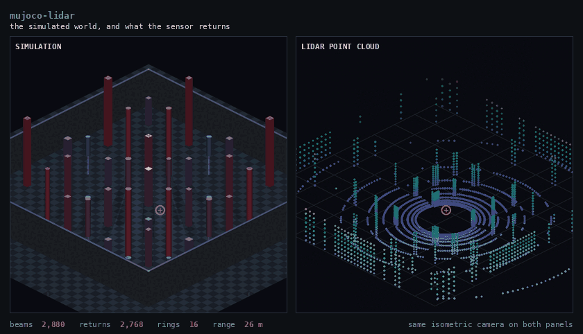
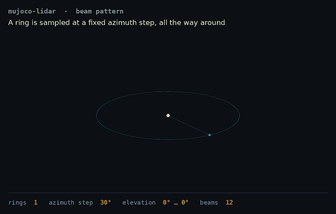

# mujoco-lidar

A reusable **3D lidar sensor for MuJoCo**, defined as a drop-in MJCF file plus a
small Python scanner. Add one `<include>` to your model and you have a
configurable multi-ring lidar producing point clouds.

Ships with a demo world of vertical obstacles, a keyboard-driven sensor, and a
browser point cloud viewer — but the sensor itself has no dependency on any of
that. Core requirements are **mujoco and numpy only**.



The simulated world on the left, and **only what the sensor actually returns**
on the right — same isometric camera on both, so every point sits exactly where
the geometry it came from sits. Watch the shadows: pillars occlude each other,
and the returns behind them simply are not there.

```
      model                        scanner                      cloud
 ┌────────────────┐        ┌───────────────────────┐      ┌───────────────┐
 │ lidar_3d.xml   │        │ site pose  ──▶ rotate │      │ (N,3) float32 │
 │  <site>        │ ─────▶ │ ray pattern           │ ───▶ │ sensor frame  │
 │  <numeric>     │        │ mj_multiRay (batched) │      │ + pose        │
 └────────────────┘        │ drop non-returns      │      └───────────────┘
                           └───────────────────────┘
```

---

## Quick start

```bash
git clone <this repo> && cd mujoco-lidar
python3 -m venv .venv
./.venv/bin/pip install -e ".[demo]"     # omit [demo] if you only want the sensor
```

Use it in your own model — the whole integration is three lines:

```python
import mujoco
from mujoco_lidar import LidarScanner, LIDAR_XML_PATH

model = mujoco.MjModel.from_xml_string(my_scene_xml,
                                       {"lidar_3d.xml": LIDAR_XML_PATH.read_bytes()})
data = mujoco.MjData(model)
scanner = LidarScanner(model, data)      # reads the beam pattern out of the XML

mujoco.mj_forward(model, data)
points = scanner.scan()                  # (N, 3) float32, sensor frame
world  = scanner.scan_world()            # the same scan in world coordinates
```

Run the working example, then the full demo:

```bash
./.venv/bin/python examples/minimal_scan.py

./run_sim.sh --stats        # MuJoCo window; fly the sensor with WASD
./run_viewer.sh             # then open http://127.0.0.1:8770
```

No display? `./run_sim.sh --headless --stats` and drive from the browser page,
which forwards the same keys.

---

## Repository layout

```
mujoco_lidar/                 the library — mujoco + numpy only
├── model/
│   └── lidar_3d.xml          ★ THE SENSOR. Self-contained MJCF, no world.
├── scanner.py                LidarConfig + LidarScanner (ray casting)
├── cloud.py                  binary point cloud wire format
├── scene.py                  the demo obstacle field (not part of the sensor)
└── comms.py                  zenoh helpers (demo only)

sim.py                        demo app: scene + keyboard control + publishing
viewer_server.py              demo app: zenoh → Flask relay
static/                       browser viewer (WebGL2, no third-party JS)
examples/minimal_scan.py      smallest working integration
```

The split is the point: **`mujoco_lidar/model/lidar_3d.xml` and `scanner.py`
are the sensor.** Everything else is a demonstration you can delete.

---

## The sensor XML

`mujoco_lidar/model/lidar_3d.xml` contains no world, no ground, no obstacles —
only the sensor, so it composes with any model:

```xml
<mujoco model="my_robot">
  <include file="lidar_3d.xml"/>
  ...your world...
</mujoco>
```

Two elements make it work.

### 1. `<site name="lidar_origin">` — where and which way the sensor looks

```xml
<site name="lidar_origin" class="lidar" pos="0 0 0.004"/>
```

Every beam is cast **from this site's world position**, with directions rotated
by **the site's world orientation**. The site is the sensor. That means mount
pose is pure XML — no Python involved:

| Attribute | Effect |
|---|---|
| `pos="x y z"` | sensor origin relative to the parent body |
| `quat="w x y z"` / `euler="r p y"` | sensor orientation relative to the parent body |

The ray frame is **+X forward, +Y left, +Z up**. So a lidar tilted 30° nose-down
is just `euler="0 30 0"` — verified: from 2 m up, its forward beam lands at
x = 3.46 m, which is `2 / tan(30°)`.

### 2. `<custom><numeric>` — the beam pattern

MJCF has no native way to say "32 rings at 0.9°" — beam counts are not a physics
concept. MuJoCo's `<custom><numeric>` carries arbitrary named float arrays,
which the scanner reads back via `mjOBJ_NUMERIC`. **This is where every lidar
property lives:**

```xml
<custom>
  <numeric name="lidar_rings"        data="32"/>
  <numeric name="lidar_elevation"    data="-22 15"/>
  <numeric name="lidar_azimuth_step" data="0.9"/>
  <numeric name="lidar_max_range"    data="35"/>
  <numeric name="lidar_rate"         data="10"/>
</custom>
```

| Property | Type | Meaning |
|---|---|---|
| `lidar_rings` | int | Number of vertical beams (elevation layers). Spaced linearly across the elevation span. With `1`, the single ring sits at the **midpoint** of the span, not at the minimum. |
| `lidar_elevation` | 2 floats | Elevation span `"min max"` in degrees. **Negative is down, positive is up.** |
| `lidar_azimuth_step` | float | Horizontal angular resolution in degrees. Azimuth always covers a full 360°, so the step is snapped to the nearest exact division — `0.7` gives 514 beams at 0.7004°, never a seam or a doubled bearing. |
| `lidar_max_range` | float | Beam cutoff in metres. A beam reaching this without hitting geometry is a **non-return and is dropped**, not emitted as a max-range point. |
| `lidar_rate` | float | Suggested scan rate in Hz. The scanner is stateless and rate-free; this is the default an application should adopt. |

What those three geometry values actually build:



A scan is a lattice, not a bag of directions: `lidar_azimuth_step` samples one
ring around a full turn, `lidar_rings` stacks those circles in elevation, and
`lidar_elevation` sets how wide the fan opens. The final shot sweeps a single
azimuth column — every ring at the same bearing.

Beam count follows directly:

```
beams = lidar_rings × round(360 / lidar_azimuth_step)
      = 32 × 400 = 12,800   (shipped defaults)
```

Any of these can be overridden in Python (`LidarConfig(...)`) or on the demo's
command line (`--rings`, `--elev-min`, …), but the XML is the default and the
single source of truth.

### 3. Mounting rigidly on a robot

The shipped body is `mocap="true"` so the standalone demo can fly it around.
To bolt it to a robot, copy the `<body name="lidar">` block into your own body
and **delete `mocap="true"`** — a mocap body must be a direct child of
`<worldbody>`, which is exactly what you do not want on a robot.

Keep the housing on its own small child body. The scanner excludes the site's
own body from raycasting, so a self-contained lidar body never sees itself,
while the rest of the robot stays scannable.

### Why not `<rangefinder>`?

MuJoCo has a `<rangefinder>` sensor, and the obvious design is to declare one
per beam. Don't. **MuJoCo evaluates declared sensors on every physics step**, so
12,800 rangefinders at a 250 Hz timestep is 3.2 million raycasts per simulated
second — even if you only consume 10 scans per second. That is 25× more work
than anything reads, and it scales with your timestep rather than your scan
rate.

This sensor declares no rangefinders. It issues **one batched `mj_multiRay` call
per scan**, so raycasting cost is tied to how often you actually ask.

---

## How a scan becomes a point cloud

`LidarScanner.scan()` is the whole pipeline. Five steps:

**1 — Build the ray pattern (once, at construction).** Elevations are
`linspace(elev_min, elev_max, rings)`; azimuths are a full turn divided into
`round(360/azimuth_step)` steps. Every (elevation, azimuth) pair becomes a unit
vector in the sensor frame:

```python
dirs = [cos(el)·cos(az),  cos(el)·sin(az),  sin(el)]
```

Stored ring-major as `(n_rays, 3)` float64, so `pattern.reshape(rings, n_azimuth, 3)`
recovers the ring layout. Built once and reused forever — the pattern never
changes, only the pose does.

**2 — Read the sensor pose from MuJoCo.** After `mj_step`/`mj_forward`, MuJoCo
has computed every site's world transform:

```python
origin = data.site_xpos[site_id]              # (3,)   world position
rot    = data.site_xmat[site_id].reshape(3,3) # (3,3)  world orientation
```

This is the "fetch" step — the scanner reads kinematics MuJoCo already computed,
rather than tracking the sensor pose itself. Move the body, the joint, or the
robot, and the sensor follows for free.

**3 — Rotate the pattern into the world, in one matmul.**

```python
np.matmul(self.pattern, rot.T, out=self._world_dirs)   # (n_rays, 3)
```

Into a preallocated buffer, so a scan does no per-frame allocation.

**4 — Cast every beam in a single batched C call.**

```python
mujoco.mj_multiRay(m, d,
    pnt=origin,                    # all beams share one origin
    vec=world_dirs.reshape(-1),    # nray × 3 directions, flat
    geomgroup=None,                # scan all geom groups
    flg_static=1,                  # include world/static geoms (ground, walls)
    bodyexclude=self.exclude_body,  # never return our own housing
    geomid=self._geomid,           # ← written: hit geom id, or -1 for a miss
    dist=self._dist,               # ← written: hit distance, or -1 for a miss
    nray=self.n_rays, cutoff=config.max_range)
```

`geomid` and `dist` are output buffers MuJoCo writes in place. `flg_static=1`
matters more than it looks: ground planes and fixed obstacles are static geoms,
and with `flg_static=0` the sensor would see straight through the entire world.

**5 — Filter and scale into points.**

```python
hit = (geomid >= 0) & (dist > 0.0)
points = (pattern[hit] * dist[hit, None]).astype(np.float32)
```

Two things worth noticing:

* **Non-returns are dropped, not padded.** A beam that hits nothing is simply
  absent from the cloud. Emitting it at max range would fabricate a shell of
  points no real sensor reports, and would make the return count a constant that
  tells you nothing. Because they are dropped, `len(points)` is a live diagnostic:
  it moves with pose in a physically meaningful way, and a sudden jump to 100% of
  the beam count means the sensor is *inside* geometry.

* **The scaling uses the *sensor-frame* pattern, not the world-frame one.** The
  pattern rows are unit vectors, so `direction × range` is already the point in
  the sensor frame — no second rotation, no inverse transform. The world-frame
  directions exist only to hand MuJoCo something to cast.

The result is `(N, 3)` float32 in the **sensor frame**, where `N` varies frame to
frame. `scan_world()` applies `points @ rot.T + origin` if you want world
coordinates; `scan(return_mask=True)` also returns the `(n_rays,)` boolean hit
mask, which is how you recover which ring and azimuth each surviving point came
from.

### Accumulating across frames

The scanner returns one instantaneous sweep. To build a map, transform each
frame to world and concatenate:

```python
clouds = []
for _ in range(200):
    mujoco.mj_step(model, data)
    clouds.append(scanner.scan_world())     # world frame, so they compose
accumulated = np.concatenate(clouds)
```

Keeping the wire format in the sensor frame with the pose in the header (rather
than pre-transforming) is what makes this the caller's choice: you can
accumulate in world frame, register frames against each other, or keep raw
sensor-frame scans for a learning pipeline.

---

## Python API

```python
LidarConfig(rings=32, elev_min=-22, elev_max=15,
            azimuth_step=0.9, max_range=35, rate=10)
LidarConfig.from_model(model, prefix="lidar_")   # read the <numeric> block

LidarScanner(model, data,
             site="lidar_origin",   # site defining ray origin + frame
             config=None,           # defaults to LidarConfig.from_model(model)
             exclude_body=None,     # defaults to the site's own body; -1 disables
             geomgroup=None,        # optional length-6 geom group mask
             include_static=True)   # scan world/static geoms

scanner.scan()                 -> (N, 3) float32, sensor frame
scanner.scan(return_mask=True) -> (points, (n_rays,) bool hit mask)
scanner.scan_world()           -> (N, 3) float32, world frame
scanner.origin()               -> (3,)  world position
scanner.quat()                 -> (4,)  world orientation, w x y z
scanner.rotation()             -> (3,3) world orientation
scanner.n_rays, .n_rings, .n_azimuth, .describe()
```

---

## Wire format

The demo publishes each frame as one flat binary blob — a 56 byte header then
tightly packed float32 XYZ. No JSON, no protobuf, no per-point parsing.

```
offset  size  field
0       4     magic b'MJLC'
4       2     version
6       2     flags
8       4     n_points
12      4     seq
16      8     stamp (unix seconds, float64)
24      12    origin, world (3 × float32)
36      16    quat, world, w x y z (4 × float32)
52      4     pad
56      ...   points, SENSOR frame (n × 3 float32)
```

The header is 56 bytes — a multiple of 4 — so the browser does
`new Float32Array(buffer, 56, n*3)` with zero copying, and the float64 timestamp
at offset 16 stays 8-byte aligned. The vertex shader applies `origin`/`quat`, so
a new frame costs one buffer upload and nothing else.

`pack_cloud()`, `unpack_header()` and `unpack_points()` in `mujoco_lidar.cloud`
are all you need to consume the stream from your own script.

---

## Demo applications

Both are optional and installed by `pip install -e ".[demo]"`.

### `sim.py` — obstacle field and keyboard control

A deterministic lattice of box and cylinder pillars across six height tiers,
with every `--block`-th row and column left empty to carve corridors, ringed by
perimeter walls. Defaults give a 13×13 lattice at 3 m spacing → 99 pillars over
about 40 × 40 m.

| Key | Action |
|---|---|
| `W` / `S` | forward / backward along the sensor heading |
| `A` / `D` | strafe left / right |
| `I` / `K` | up / down |
| `Q` / `E` | yaw left / right |
| `R` | reset pose |
| `P` | print pose |

Works in both the MuJoCo window and the browser page.

Two behaviours to know:

* **`--spawn-clearance` (default 2.5 m) exists for a reason.** With an odd
  row/column count a lattice cell lands exactly on the origin, and without the
  clearing the sensor spawns *inside* a pillar — every beam then returns about a
  metre and the cloud collapses to a ball.
* **The sensor has no collision.** It rides a mocap body, which is kinematic by
  design, so it flies straight through pillars. If returns jump to 100% of the
  beam count and the cloud shrinks to a blob at the gizmo, you are inside an
  obstacle — press `R`.
* **`sim.py` exits via `os._exit`.** MuJoCo's passive viewer can fault inside its
  own teardown during interpreter shutdown (reproducible on mujoco 3.11 with
  GLFW on Linux), printing `Segmentation fault (core dumped)` after the run has
  already finished cleanly. The demo shuts its session down and then leaves
  immediately rather than hand control to that destructor. If you drive
  `LidarScanner` from your own `launch_passive` script and see the same crash on
  exit, that is where it comes from — not from the scan.

```bash
./run_sim.sh --rings 64 --azimuth-step 0.5      # 46k beams, dense
./run_sim.sh --rings 16 --azimuth-step 2        # 2.9k beams, cheap
./run_sim.sh --elev-min -45 --elev-max 45       # wide vertical fan
./run_sim.sh --rows 21 --cols 21 --spacing 2.5  # bigger, tighter field
./run_sim.sh --dump-xml /tmp/scene.xml          # inspect the generated MJCF
```

### `viewer_server.py` + `static/` — browser viewer

Subscribes to the cloud topic and relays the untouched blob to a WebGL2 page.
The front end has **no third-party dependency** — no three.js, no CDN — just two
shader programs and ~70 lines of matrix maths, so it works air-gapped.

Runtime controls (display only; they do not change what the sensor casts):
colour by height or range, point size, display range clip, camera-follow,
ground grid.

| Route | Description |
|---|---|
| `GET /` | the viewer page |
| `GET /api/cloud?since=<seq>` | latest frame as `application/octet-stream`; `204` if the client already has `seq` |
| `POST /api/cmd` | `{"key": "w"}` → published to the command topic |
| `GET /api/status` | JSON: connected, frame count, rate, age, last header |

Topics are `mujoco_lidar/points` and `mujoco_lidar/cmd`. Zenoh runs as a
loopback-only peer by default so the demo is not a bad network neighbour; set
`MUJOCO_LIDAR_LOCALHOST=0` for the stock configuration.

---

## What this sensor does *not* model

Being explicit, since it matters if you plan to use it as a sensor model rather
than a geometry probe:

- **No noise** — ranges are exact ray/geometry intersections. No range noise, no
  dropout, no incidence-angle falloff.
- **No intensity or reflectivity** channel.
- **No motion distortion** — the whole sweep is sampled at one instant, so there
  is no rolling-shutter skew to deskew. Real spinning lidar sweeps over time.
- **Uniform ring spacing only** — real units such as a VLP-16 have non-uniform
  elevation tables; there is no per-ring override yet.
- **Single echo**, no multi-return.

All of these are straightforward to add on top of `scan(return_mask=True)`,
which gives you the per-beam mask needed to attribute noise or dropout correctly.

---

## Licence

MIT. See [LICENSE](LICENSE).
